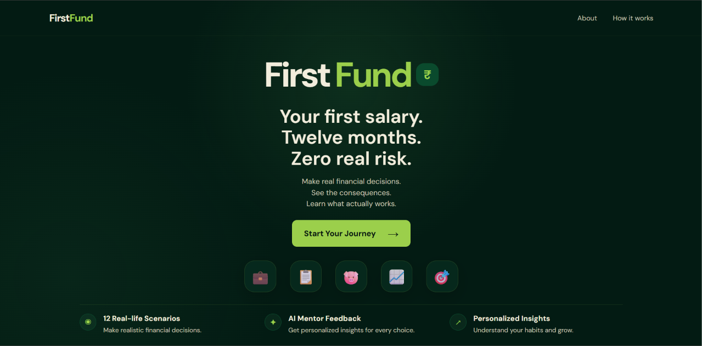
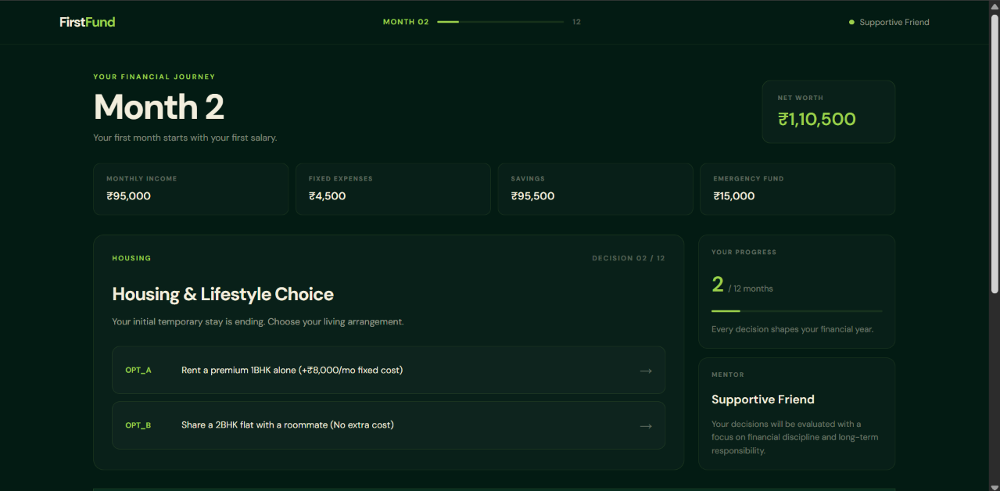
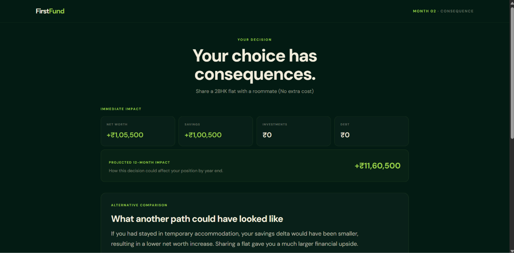
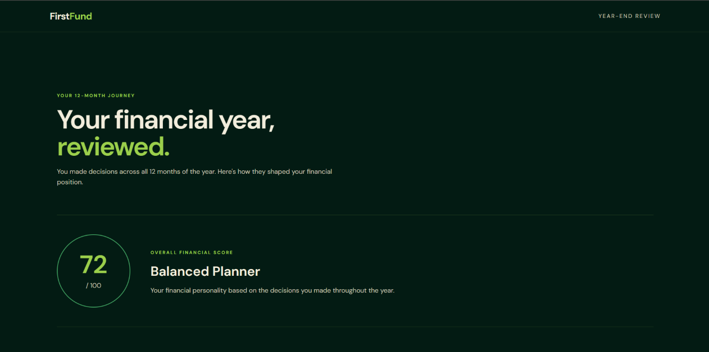
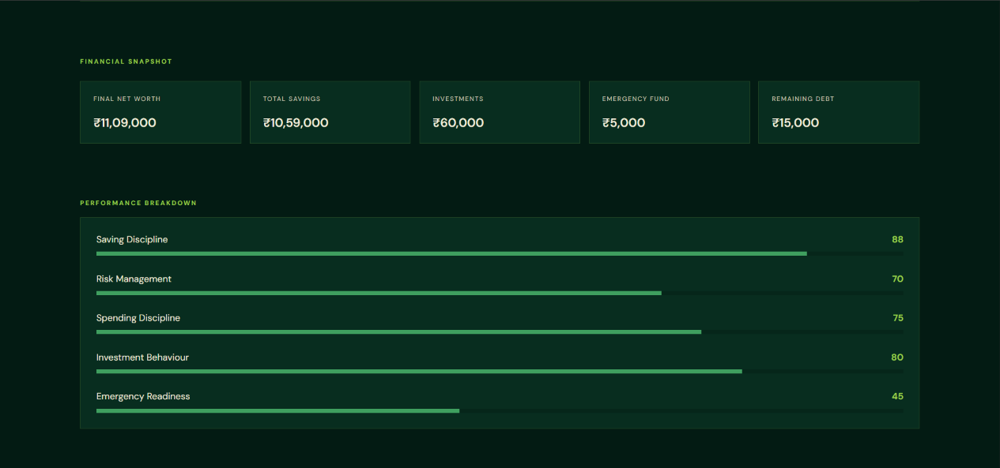
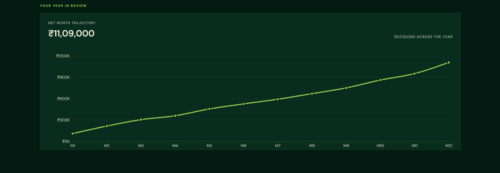
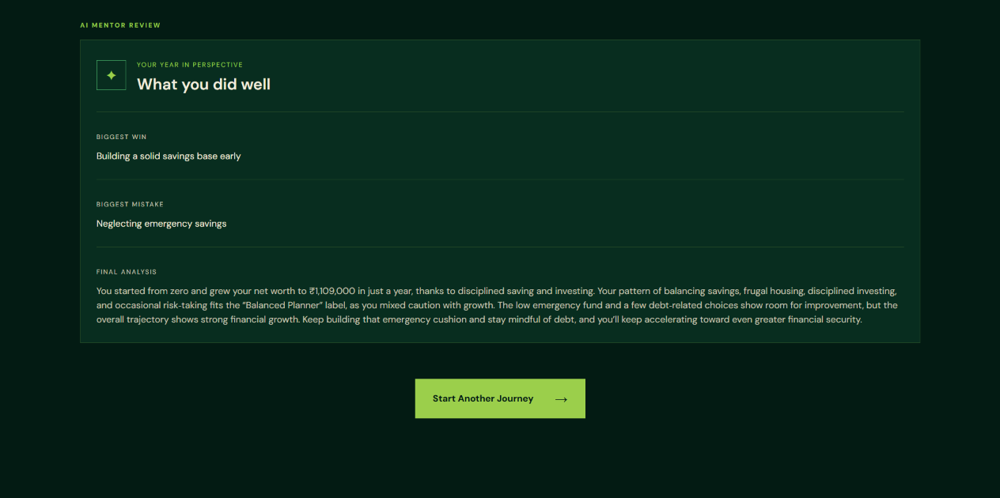

# 💰 FirstFund

### Your first salary. Your first decisions. Your financial future.

**FirstFund** is an interactive financial decision-making simulator designed to help young adults understand how everyday financial choices can affect their long-term financial health.

Instead of simply telling users how to manage money, FirstFund lets them **experience the consequences of their financial decisions** through a simulated 12-month journey.

> **Make financial decisions. See the consequences. Build better habits.**

## 🌐 Live Demo

👉 **[Try FirstFund](https://firstfund.vercel.app/)**

---

## 📸 Preview

### 🏠 Landing Page



### 🎯 Financial Simulation



### 📊 Consequences



### 🏆 Final Financial Scorecard






---

## ✨ Features

* 🎯 **Interactive Financial Simulation**

  * Experience a simulated 12-month financial journey.
  * Make decisions based on realistic financial situations.

* 💸 **Real-Time Financial Consequences**

  * See how decisions affect savings, investments, debt, emergency funds, and net worth.

* 🤖 **AI-Powered Feedback**

  * Receive personalized explanations about the decisions you make.
  * Understand the reasoning and potential consequences behind different choices.

* 🔀 **Alternative Financial Paths**

  * Explore how different choices can lead to different financial outcomes.

* 🧠 **Financial Personality**

  * Get insights into your financial behaviour based on the choices you make throughout the simulation.

* 📊 **Financial Analytics**

  * Track your financial progress using visual charts and metrics.
  * Review your performance through a final financial scorecard.

* 👨‍🏫 **Mentor Personas**

  * Receive guidance and feedback through different mentoring styles.

---

## 🧩 How It Works

### 1. Create Your Financial Profile

The simulation begins by collecting basic information such as:

* Expected salary
* City tier
* Housing situation
* Financial preferences
* Mentor persona

This information is used to personalize the simulation.

### 2. Start Your Financial Journey

FirstFund initializes a unique simulation session and creates your starting financial state.

The simulator tracks factors such as:

```text
Income
Expenses
Savings
Emergency Fund
Investments
Debt
Net Worth
```

### 3. Make Financial Decisions

Throughout the simulation, users encounter different real-world financial situations.

For example:

> **Your first paycheck has arrived. How will you use your surplus?**

The user chooses from multiple options, each with different consequences.

### 4. Experience the Consequences

Every decision changes the user's financial state.

A choice that seems beneficial in the short term may have long-term consequences, allowing users to understand the importance of financial planning.

### 5. Receive AI Feedback

The AI analyzes the user's decisions and provides contextual feedback explaining:

* The financial impact of the decision
* Why the decision matters
* Potential future consequences
* Alternative approaches

### 6. Get Your Final Scorecard

At the end of the journey, FirstFund generates a financial scorecard containing insights such as:

* Overall financial score
* Saving discipline
* Spending discipline
* Investment behaviour
* Risk management
* Emergency readiness
* Final net worth
* Savings
* Investments
* Emergency fund
* Remaining debt
* Financial personality

---

## 🛠️ Tech Stack

### Frontend

* **React**
* **Vite**
* **JavaScript**
* **Recharts**
* **CSS**

### Backend

* **Node.js**
* **Express.js**
* **Groq SDK**
* **UUID**
* **CORS**
* **dotenv**

### AI

FirstFund uses an LLM through the **Groq API** to generate contextual feedback based on the user's financial decisions.

---

## 🏗️ Architecture

```text
                         ┌───────────────────┐
                         │     FirstFund     │
                         └─────────┬─────────┘
                                   │
                    ┌──────────────┴──────────────┐
                    │                             │
           ┌────────▼─────────┐          ┌────────▼─────────┐
           │     Frontend     │          │      Backend      │
           │                  │          │                   │
           │ React + Vite     │◄────────►│ Node.js + Express │
           │ Recharts         │   API    │                   │
           └──────────────────┘          └─────────┬─────────┘
                                                   │
                                          ┌────────▼─────────┐
                                          │    AI Module     │
                                          │   Groq / LLM     │
                                          └──────────────────┘
```

---

## 🔌 API

The backend provides endpoints for managing the simulation:

| Method | Endpoint                               | Description                    |
| ------ | -------------------------------------- | ------------------------------ |
| `GET`  | `/`                                    | Backend health check           |
| `POST` | `/api/simulation/start`                | Start a new simulation         |
| `GET`  | `/api/simulation/:sessionId`           | Restore an existing simulation |
| `POST` | `/api/simulation/decision`             | Submit a financial decision    |
| `GET`  | `/api/simulation/:sessionId/scorecard` | Generate the final scorecard   |

---

## 📁 Project Structure

```text
FirstFund/
│
├── screenshots/
│   ├── home.png
│   ├── simulation.png
│   ├── dashboard.png
│   └── scorecard.png
│
├── frontend/
│   ├── public/
│   ├── src/
│   │   ├── components/
│   │   ├── services/
│   │   └── ...
│   ├── package.json
│   └── vite.config.js
│
├── backend/
│   ├── ai/
│   ├── server.js
│   ├── package.json
│   └── package-lock.json
│
├── .gitignore
└── README.md
```

---

## 🚀 Getting Started

### Prerequisites

Make sure you have:

* [Node.js](https://nodejs.org/)
* npm
* A Groq API key

### 1. Clone the Repository

```bash
git clone https://github.com/soumyaraii/FirstFund.git
cd FirstFund
```

### 2. Set Up the Backend

```bash
cd backend
npm install
```

Create a `.env` file inside the `backend` directory:

```env
GROQ_API_KEY=your_groq_api_key
PORT=5000
```

Start the backend:

```bash
npm run dev
```

### 3. Set Up the Frontend

Open a new terminal:

```bash
cd frontend
npm install
npm run dev
```

Open the local URL provided by Vite in your browser.

---

## 🔐 Environment Variables

Create a `.env` file in the backend directory:

```env
GROQ_API_KEY=your_groq_api_key
PORT=5000
```

**Never commit your API keys or other secrets to GitHub.**

Make sure `.env` is included in your `.gitignore`.

---

## 💡 What I Built

FirstFund was designed as more than a financial calculator. The project focuses on making **financial literacy interactive and experiential**.

Key aspects of the project include:

* Designing an interactive financial simulation
* Building a dynamic React frontend
* Creating backend APIs to manage simulation state
* Implementing financial decision logic
* Integrating an LLM for personalized feedback
* Building financial scoring and analytics
* Visualizing financial progress through charts
* Designing a final financial personality and scorecard

---

## 🎯 Why FirstFund?

Financial literacy is often taught through articles, videos, or generic advice.

FirstFund takes a different approach.

Instead of simply telling someone:

> *"You should save money."*

it lets them **make the decision, experience the outcome, and understand why it matters.**

The project aims to make concepts such as:

* 💰 Saving
* 🚨 Emergency funds
* 📈 Investing
* 💳 Debt management
* 🛍️ Spending
* ⚠️ Risk management
* 📊 Long-term financial planning

more understandable and memorable for young adults.

---

## 🔮 Future Improvements

* [ ] Persistent user accounts
* [ ] Database-backed simulation sessions
* [ ] More financial scenarios
* [ ] Custom financial goals
* [ ] Expanded investment simulations
* [ ] Historical simulation comparison
* [ ] Improved financial personality analysis
* [ ] Mobile optimization
* [ ] Production deployment
* [ ] More advanced AI financial coaching

---

## ⚠️ Disclaimer

FirstFund is an **educational simulation** and is not intended to provide professional financial, investment, tax, or legal advice.

The financial outcomes presented by the simulator are simplified representations intended for educational purposes.

---

## 👩‍💻 Author

**Soumya Rai**

GitHub: **[@soumyaraii](https://github.com/soumyaraii)**

---

## ⭐ Support

If you found FirstFund interesting, consider giving the repository a ⭐ on GitHub!
